<p align="center">
  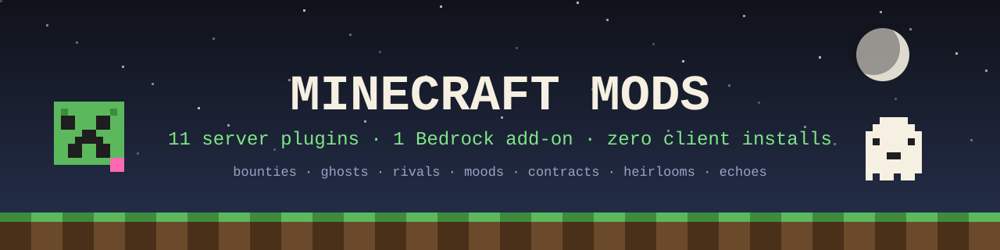
</p>

<p align="center">
  <a href="../../releases/latest"></a>
  <a href="../../releases"></a>
  <a href="LICENSE"></a>
  
  
</p>

**Eleven original Minecraft server plugins + one Bedrock add-on** — quests, ghosts, rivalries, moody mobs, insurance fraud (the legal kind), and items that outlive you. Every plugin is **100% server-side**: drop a jar into `plugins/`, restart, done. Your players install **nothing**.

Built for **Paper**, **Spigot** and **Purpur** servers on **Minecraft 1.21+** — survival servers, SMPs, and friend groups who want their world to feel alive without a modpack.

> ⚡ **TL;DR:** [Grab the jars from the latest release](../../releases/latest) → drop in `plugins/` → restart → type `/bounty`.

---

## 🎮 The mods

<table>
<tr>
<td width="33%"><a href="bounty-board-paper"></a></td>
<td width="33%"><a href="ghost-replay-paper">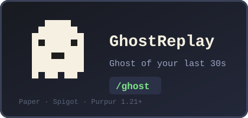</a></td>
<td width="33%"><a href="sworn-rivals-paper">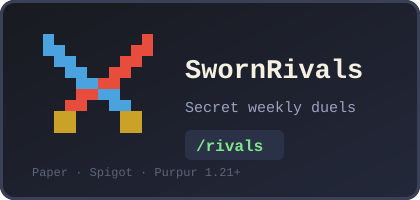</a></td>
</tr>
<tr>
<td><a href="mob-moods-paper">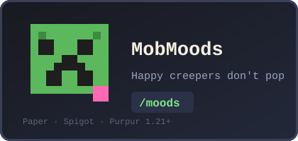</a></td>
<td><a href="time-capsule-paper">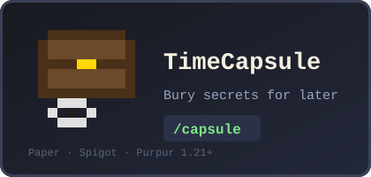</a></td>
<td><a href="cartographers-contracts-paper">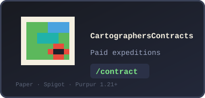</a></td>
</tr>
<tr>
<td><a href="season-pass-paper">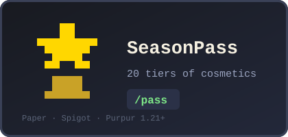</a></td>
<td><a href="heirloom-items-paper">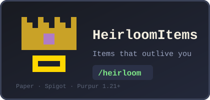</a></td>
<td><a href="weather-insurance-paper">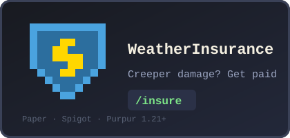</a></td>
</tr>
<tr>
<td><a href="echo-chambers-paper">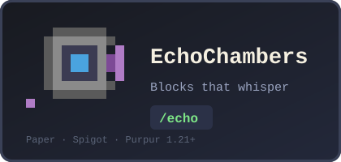</a></td>
<td><a href="the-collector-paper">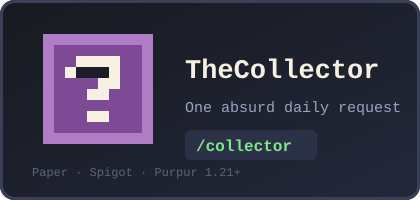</a></td>
<td></td>
</tr>
</table>

| Plugin | What your players will experience | Command |
|---|---|---|
| 🏹 **[BountyBoard](bounty-board-paper)** | 3 daily rotating hunt/mine/deliver quests, Common → Epic tiers, streak bonuses up to +100% | `/bounty` |
| 👻 **[GhostReplay](ghost-replay-paper)** | After death, a ghost wearing your head walks your final 30 seconds back to your loot | `/ghost` |
| ⚔️ **[SwornRivals](sworn-rivals-paper)** | A secret rival every week — outscore them at mining, hunting and PvP to steal their buff | `/rivals` |
| 🐸 **[MobMoods](mob-moods-paper)** | Cheerful creepers refuse to explode; grumpy zombies sprint. Sweet berries change everything | `/moods` |
| ⏳ **[TimeCapsule](time-capsule-paper)** | Seal a chest + note for up to 30 days — unbreakable, blast-proof, server-wide reveal | `/capsule` |
| 🗺️ **[CartographersContracts](cartographers-contracts-paper)** | Buy expeditions to real located structures up to 3,000 blocks out; arriving pays out | `/contract` |
| 🌟 **[SeasonPass](season-pass-paper)** | A free 20-tier battle pass: name colors, particle trails, chat titles — cosmetic only, no pay-to-win | `/pass` |
| 👑 **[HeirloomItems](heirloom-items-paper)** | Name an heir; your treasured item skips the death drop and passes down with visible lineage | `/heirloom` |
| ☂️ **[WeatherInsurance](weather-insurance-paper)** | Insure a chunk for 10 emeralds — creeper blasts, fire and lightning pay automatic claims | `/insure` |
| 🔮 **[EchoChambers](echo-chambers-paper)** | Record 10 seconds of chat into a lodestone; it whispers to whoever walks past. Haunted houses, museums, greetings | `/echo` |
| 🎁 **[TheCollector](the-collector-paper)** | *"Three poisonous potatoes. Do not ask why."* One absurd request a day — first to deliver wins | `/collector` |

📱 **Bedrock Edition?** [BountyBoard ships as a Script API behavior pack too](bounty-board) — grab `BountyBoard.mcpack` from the release, double-click, enable, and open the board with a Book. No experimental toggles.

---

## 🚀 Quick start (60 seconds)

1. Download any jar from the **[latest release](../../releases/latest)** — mix and match, they're independent.
2. Drop it into your server's `plugins/` folder.
3. Restart. That's it — YAML persistence, sounds, particles and per-player state are all built in.

**Requirements:** Paper, Spigot or Purpur **1.21.4+** · **Java 21** · zero dependencies, zero config needed.
**Compatibility note:** SeasonPass and EchoChambers use Paper's modern chat API and want Paper/Purpur; everything else runs on plain Spigot too.

## 🧠 Why these exist

Most quest/cosmetic plugins are config labyrinths. These are the opposite: **one idea each, zero setup, instant fun**. They're designed for survival servers that want *moments* — the server-wide broadcast when a 3-week-old time capsule cracks open, the gasp when a dead player's ghost walks past the base, the outrage when your secret rival outscores you by two points on a Sunday night.

All 11 plugins were smoke-tested loading **together** on a clean Paper 1.21.4 server — clean enables, zero errors, no conflicts.

## 🔨 Build from source

```sh
git clone https://github.com/mohitagw15856/minecraft-mods.git
cd minecraft-mods/<any>-paper
./gradlew build          # → build/libs/<name>-1.0.0.jar   (needs JDK 21)
```

The Bedrock pack needs no build: `cd bounty-board && zip -r ../BountyBoard.mcpack manifest.json pack_icon.png scripts`

## 📸 Screenshots wanted

These mods are brand new — if you run them, **in-game screenshots and clips are the most valuable contribution you can make**. Open an issue or PR with your captures and they'll go right here with credit.

## 🤝 Contributing & support

- 🐛 Found a bug? [Open an issue](../../issues) — include your Paper version and the stack trace.
- 💡 Mod idea? Issues welcome — the best ones get built.
- ⭐ **If any of these made your server more fun, a star helps other server owners find them.**

## 📜 License

[MIT](LICENSE) — use them, fork them, ship them on your network. Attribution appreciated, never required.

---

<p align="center"><sub>Keywords: minecraft plugins · paper plugins 1.21 · spigot plugins · purpur · minecraft server mods · survival smp plugins · minecraft quest plugin · battle pass plugin · minecraft bedrock addon · script api</sub></p>
